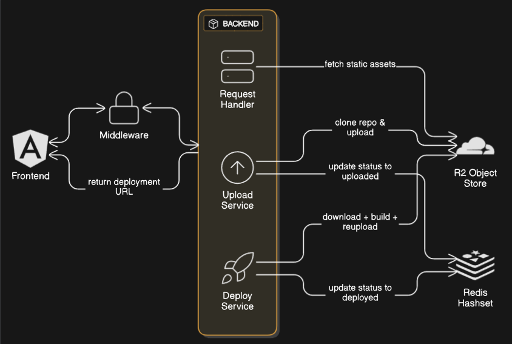

# ⚡ Jett Platform

**Jett** is a modern deployment service built with a robust **microservice architecture**.  
Its frontend is developed using **Angular 20** with **server-side rendering**, paired with an **Express backend** that leverages **JWT** for secure authentication.

The platform orchestrates deployment workflows through three dedicated microservices:

- 🗂️ **Request Handler Service** – Manages user requests.
- ☁️ **Upload Service** – Integrates with **Cloudflare R2** for scalable storage.
- 🚀 **Deploy Service** – Uses a **GitHub Actions worker** to automate project deployments.

The **Request Handler** and **Upload Service** are containerized with **Docker** and deployed on **Render**, ensuring reliability and scalability.  
To provide **real-time feedback**, Jett uses a **Redis hashset** to track deployment status.

Beyond personal deployments, Jett also **showcases community projects**, fostering collaboration and discovery.  
By combining modern frontend technologies, cloud-based storage, CI/CD automation, and real-time tracking, Jett delivers a powerful and secure deployment ecosystem.

---

## ✨ Features

📦 **Microservice architecture** – independently scalable services.

🖥️ **Modern frontend** – Angular 20 + SSR for speed.

🔐 **Secure authentication** – JWT-based auth via middleware.

☁️ **Cloudflare R2 integration** – scalable object storage.

⚡ **Redis hashset** – real-time deployment status tracking.

🐳 **Dockerized services** – containerized deployments on Render.

🔄 **CI/CD automation** – GitHub Actions for building + deploying projects.

🌍 **Community showcase** – explore and share deployed projects.

---

## 🏗️ Architecture



_(Above: System flow between frontend, middleware, and backend microservices with Redis + Cloudflare R2 integration.)_

---

## 📂 Repositories

| Component              | Description                                                   | Repo                                                                                          |
| ---------------------- | ------------------------------------------------------------- | --------------------------------------------------------------------------------------------- |
| 🖥️ **Frontend**        | Angular 20 app with server-side rendering                     | [jett-frontend](https://github.com/sahil-ansari-47/jett-frontend)                             |
| 🔗 **Middleware**      | Express-based gateway handling authentication & DB connection | [jett-middleware](https://github.com/sahil-ansari-47/jett-middleware)                         |
| 📤 **Upload Service**  | Clones repos, uploads to **Cloudflare R2**, updates Redis     | [jett-upload-service](https://github.com/Sandarva-9304/jett-upload-service)                   |
| 🚀 **Deploy Service**  | GitHub Actions worker, builds + redeploys assets to R2        | [jett-deploy-service](https://github.com/Sandarva-9304/jett-deploy-service)                   |
| ⚡ **Request Handler** | Serves static assets from R2, routes deployment requests      | [jett-request-handler-service](https://github.com/Sandarva-9304/jett-request-handler-service) |

---

## ⚡ Quick Start

### 1️⃣ Clone all repositories

```bash
git clone https://github.com/sahil-ansari-47/jett-frontend
git clone https://github.com/sahil-ansari-47/jett-middleware
git clone https://github.com/Sandarva-9304/jett-upload-service
git clone https://github.com/Sandarva-9304/jett-deploy-service
git clone https://github.com/Sandarva-9304/jett-request-handler-service
```

### 2️⃣ Install dependencies & run services

```bash
cd jett-<service-name>
npm install
npm run dev
```

### 3️⃣ Access the frontend

```bash
http://localhost:4200
```

---

## ⚙️ Configuration

Each service uses environment variables. Example .env setup:

```bash
PORT=3000
JWT_SECRET=your-secret
MONGODB_URL=<mongodb-connection>
REDIS_URL=<redis-connection>
CLOUDFLARE_R2_BUCKET=<bucket-name>
CLOUDFLARE_R2_KEY=<access-key>
CLOUDFLARE_R2_SECRET=<secret-key>
```

👉 Check each repository for service-specific .env requirements.

---

## 🛠️ Development

- **Frontend:** Angular 20

- **Backend / Services:** Node.js (TypeScript, Express)

- **Database / Cache:** Redis , MongoDB

- **Storage:** Cloudflare R2

- **CI/CD:** GitHub Actions

- **Deployment:** Render (Dockerized services) , Vercel

Run tests (where available):

```bash
npm run test
```

---

## 🐞 Troubleshooting

Ensure **.env** is set for each service.

Verify Node.js and npm versions match project requirements.

If services fail, check logs:

```bash
npm run dev
```

For Redis and MongoDB connection issues, confirm Redis and MongDB are running and accessible.

---

## 👨‍💻 Contributors

- **[Sandarva-9304](https://github.com/Sandarva-9304)**
  – Backend Microservices

- **[sahil-ansari-47](https://github.com/sahil-ansari-47)**
  – Frontend & Middleware

---

**Deploy with Jett 🚀**
